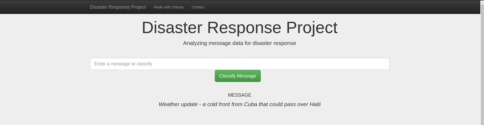

# Disaster Response Pipeline Project

## Overview
Our projects is a web app that classify disaster messages. The dataset is provided by [figure-eight](https://appen.com/), there are about 26248 messages with multiclasses responses.

## Installation
The required Python packages: 
- pandas
- numpy
- scikit-learn
- nltk
- sqlalchemy

## Project Files:
* **data/process_data.py**: This script performs data cleansing and dumping to SQL database 
* **models/train_classifier.py**: This script provide model trainer for disaster response dataset
* **app/run.py**: file to run the web app

### Instructions:
1. Run the following commands in the project's root directory to set up your database and model.

    - To run ETL pipeline that cleans data and stores in database
        `python3 data/process_data.py data/disaster_messages.csv data/disaster_categories.csv data/disaster_response.db`
    - To run ML pipeline that trains classifier and saves
        `python3 models/train_classifier.py data/disaster_response.db models/disaster_response_model.pkl`
    - To run your web app.
        `python3 app/run.py`

2. Go to http://0.0.0.0:3001/
   Or Go to http://localhost:3001/
